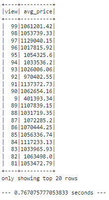

# Home-Sales
This repository is for the Data Analytics Bootcamp Module 22 Challenge-Big Data

In this challenge, I used my knowledge of SparkSQL to determine key metrics about home sales data. I used Spark to create temporary views, partition the data, cache and uncache a temporary table, and verify that the table was uncached. By timining different query methods, I was able to determine that caching the temporary view yielded the quickest results. Partitioning the query by year built actually yielded the slowest results, while the original temporary view landed between the two. 

## Original Query

## Cached Query
  

## Partitioned Query
  

I referenced class activities and instruction provided by Instructor Brett Barnes and TA Ally Qi to complete this activity.
I also referenced this site for SQL query building (https://www.sqltutorial.org/sql-date-functions/how-to-extract-year-from-date-in-sql/)
